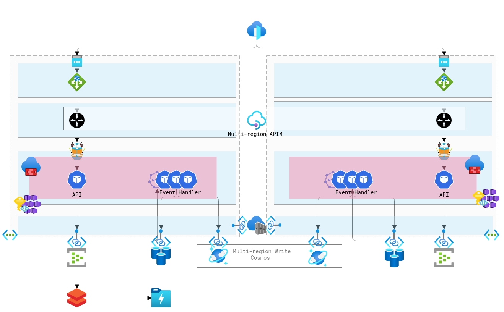

# Introduction
A very simple setup for Command Query Responsibility Separation (CQRS) in Azure that can be deployed to one or more Azure regions.
In other words, the world's most expensive random number generator....

# Setup

## Infrastructure Steps
* cd ./Infrastructure
* ./create_infrastructure.sh -g CQRS_RG -r centralus -r ukwest --client-secret {SPN secret} 
* ./setup_diagnostics.sh -n ${appName} -g CQRS_RG -r centralus _optional_
    * appName will be display at the end of the create_infrastructure.sh script 

## Application Deployment 
* cd ./Infrastructure
* ./deploy_application.sh -n ${appName} -g CQRS_RG -r centralus -r ukwest -v 1.0

## Expose API Externally _optional_ 
* The create_infrastructure and deploy_application scripts create the foundations for this demo. The demo can be expanded to include additional Azure resources - Front Door, API Maanagment, Azure App Gateway.  

### SSL Cert Requirements 
* To expose the application externally, TLS certificates and a Domain name are required. I used Let's Encrypt and Azure DNS to host my domain name.
* We need to create 2 certificates. One for API Management and one for APP Gateway
* Steps:
    * curl https://get.acme.sh | sh
    * acme.sh --issue --dns dns_azure -d portal.bjdcsa.cloud -d management.bjdcsa.cloud -d developer.bjdcsa.cloud -d api-internal.us.bjdcsa.cloud -d api-internal.uk.bjdcsa.cloud -d management.scm.bjdcsa.cloud
    * acme.sh --issue --dns dns_azure -d api.bjdcsa.cloud -d api.us.bjdcsa.cloud -d api.uk.bjdcsa.cloud
    * acme.sh --toPkcs -d portal.bjdcsa.cloud
    * acme.sh --toPkcs -d api.bjdcsa.cloud
    * pwsh > [convert]::ToBase64String( (Get-Content -AsByteStream .\portal.bjdcsa.cloud.pfx) _This will be used in the Azure ARM Templates_
    * pwsh > [convert]::ToBase64String( (Get-Content -AsByteStream .\api.bjdcsa.cloud.pfx) _This will be used in the Azure ARM Templates_

### API Management 
* Update apim\azuredeploy.parameters.json 
    * apiManagementName: bjdapim001
    * secondaryLocation: ukwest
    * primaryVnetName/secondaryVnetName: Names determined from the create_infrastructure script
    * primaryVnetResourceGroup/secondaryVnetResourceGroup: CQRS_RG
    * customDomain: bjdcsa.cloud
    * customDomainCertificateData: Base64 output of portal.bjdcsa.cloud.pfx
    * customDomainCertificatePassword: password for pfx file
    * multiRegionDeployment: "true"
* cd .\apim
* New-AzResourceGroupDeployment -Name apim -ResourceGroupName CQRS_RG -TemplateParameterFile .\azuredeploy.parameters.json -TemplateFile .\azuredeploy.json
* cd ..\product
* .\Deploy.ps1 -ResourceGroupName CQRS_RG -ResourceLocation centralus -SecondaryRegion "UK West" -ApiManagementName bjdapim001 -primaryBackendUrl http://10.1.4.97 -SecondaryBackendUrl http://10.2.4.97

### APP Gateway 
* Update gateway\azuredeploy.parameters.json
    * appGatewayName: bjdgw001
    * multiRegionDeployment: true
    * secondaryLocation: ukwest
    * primaryVnetName/secondaryVnetName: Names determined from the create_infrastructure script
    * primaryVnetResourceGroup/secondaryVnetResourceGroup: CQRS_RG
    * domainCertificateData: Base64 output of api.bjdcsa.cloud.pfx
    * domainCertificatePassword: password for pfx file
    * primaryBackendEndFQDN: api-internal.us.bjdcsa.cloud
    * secondaryBackendEndFQDN: api-internal.uk.bjdcsa.cloud
* cd .\gateway
* New-AzResourceGroupDeployment -Name appgw -ResourceGroupName CQRS_RG -TemplateParameterFile .\azuredeploy.parameters.json -TemplateFile .\azuredeploy.json

### Front Door
* Update frontdoor\azuredeploy.parameters.json
    * frontDoorName: bjdfd001
    * frontDoorUrl: api.bjdcsa.cloud
    * primaryBackendEndFQDN: api.us.bjdcsa.cloud
    * secondaryBackendEndFQDN: api.uk.bjdcsa.cloud
* cd ..\frontdoor
* New-AzResourceGroupDeployment -Name frontdoor -ResourceGroupName CQRS_RG -TemplateParameterFile .\azuredeploy.parameters.json -TemplateFile .\azuredeploy.json

## Test
* ./Scripts/create_keys.sh 100 
    * You will need to be on a system that has connectivity to the Internal IP of the AKS Ingress controller
* Check Cosmos db and Redis Cache to validate the keys have been written to both Cosmos and Redis
    * Redis Console Commands
        * LIST *
        * GET <keyid>
* If you created the services to expose the API externally then you can do:
    * Get subscription Key from APIM for Key-Service product
    * Invoke-RestMethod -UseBasicParsing -Uri https://api.bjdcsa.cloud/k/1000?subscription-key={apikey} -Method Post
        * if you do a k get pods -w you should see KEDA scale the number of pods servicing the Event Hub processor function.
    * Invoke-RestMethod -UseBasicParsing -Uri https://api.bjdcsa.cloud/k/{guid}?subscription-key={apikey} -Method Get
    * Can also use api.us.bjdcsa.cloud and api.uk.bjdcsa.cloud
    
# To Do List 
- [x] Infrastructure 
- [x] Test Flexvol with local.settings.json for Functions in container
- [x] Sample Python Script to create events published to Event Hub
- [x] Azure Function to process event, storing in Cosmos and Redis Cache
- [x] Go Write API to generate events to Event Hub 
- [x] Go Read API to read from Redis 
- [x] Go Read API to read from Cosmos db using SQL API
- [x] Deployment artifacts to Kubernetes
- [x] Configure Scaling with Keda 
- [x] Add Application Insights - golang
- [x] Add Application Insights - Azure Funtions
- [x] Log Analytics automation 
- [x] Update deployments to Helm 3
- [x] Multiple Region Deployment with Azure Front Door
- [x] Add support for Cosmos DB private endpoint
- [x] Add support for Storage private endpoint
- [ ] Add support for Redis Cache (preview)
- [x] Add support for Azure Private DNS Zones
- [ ] Update diagrams and documention
- [ ] GitHub Actions pipeline 

# Issues
- [x] Docker build on Azure Functions has warnings. func kubernetes deploy does not
    * docker build -t bjd145/eventprocessor:1.1 . 
        * /root/.nuget/packages/microsoft.azure.webjobs.script.extensionsmetadatagenerator/1.1.2/build/Microsoft.Azure.WebJobs.Script.ExtensionsMetadataGenerator.targets(52,5): warning :     Could not evaluate 'Cosmos.CRTCompat.dll' for extension metadata. Exception message: Bad IL format. [/src/dotnet-function-app/eventing.csproj]
        * Downgrading to Microsoft.NET.Sdk.Functions Version "1.0.24" resolved the issue
